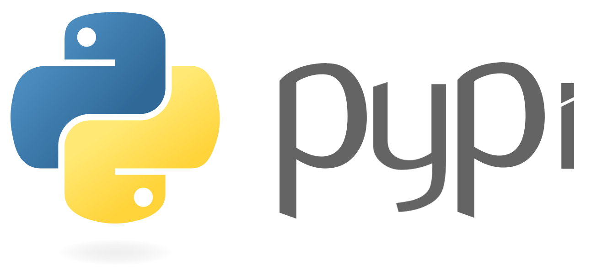

# Cómo subir tu paquete a PyPI



Yo les voy a mostrar lo que a mí me funcionó después de intentar de muchas formas distintas.

La carpeta del paquete tiene que quedar así:
```
setup.py
setup.cfg
LICENSE
README.md
tu_paquete/
     __init__.py
     archivo1.py
     archivo2.py
     archivo3.py
     ...
```
En el archivo `setup.py` esto:
```
import setuptools
import tu_paquete

setuptools.setup(
    name = 'El nombre de tu paquete que va a aparecer en PyPI',
    packages = [
        'tu_paquete',
        'tu_paquete.algun_submodulo'
    ],
    version = 'Version, ej: 0.1',
    description = 'Descripcion',
    author = 'Nombre del autor',
    author_email = 'Mail del autor',
    url = 'Repo de github',
    download_url = 'https://github.com/user/tu_paquete/tarball/0.1',
    keywords = ['palabras', 'clave', 'para el buscador'],
    data_files = [('nombre-de-la-carpeta', [
        'Direccion los archivos',
        'tu_paquete/archivo'
    ])],
    install_requires=[
        'Dependencias'
    ],
    entry_points = {
        'console_scripts': [
            'nombre-del-comando-terminal=modulo:funcion'
        ]
    }
)
```
De todo eso, hay algunas que no son obligatorias, pero te voy a explicar algunas para que sepas como funciona.

Primero que nada, como ves, te pide un enlace de descarga. Este se consigue con git. Les pongo el comando y luego un ejemplo:  
`git tag {version} -m "Descripcion del tag"`  
`git tag 0.1 -m "Primera version estable"`  
Y luego en el enlace de descarga pones:  
`https://github.com/user/tu_paquete/tarball/{version}`  
`https://github.com/user/tu_paquete/tarball/0.1`  

En `data_files`, van todos los archivos que no sean `.py` y que tu paquete vaya a necesitar. Se van a guardar en `carpeta-de-python/nombre-de-la-carpeta`.

Y en `entry_points>console_scripts` pones si quieres que se pueda ejecutar desde la consola, por ejemplo:
```
'console_scripts': [
    'mi-script=mi_paquete.script:main'
]
```
Eso va a hacer, que si pones mi-script en la consola, se ejecute la función main del archivo script.py del paquete.

Pro último, en el archivo `setup.cfg`:
```
[metadata]
    description-file = README.md
```

Ahora ya estamos listos para subirlo. Primero, asegurate de tener instalado wheel y setuptools con:  
`pip install wheel`  
`pip install setuptools`  
Y para subir el paquete usa:  
`python setup.py sdist bdist_wininst upload`  
Logeate con tu cuenta de PyPI y listo.
